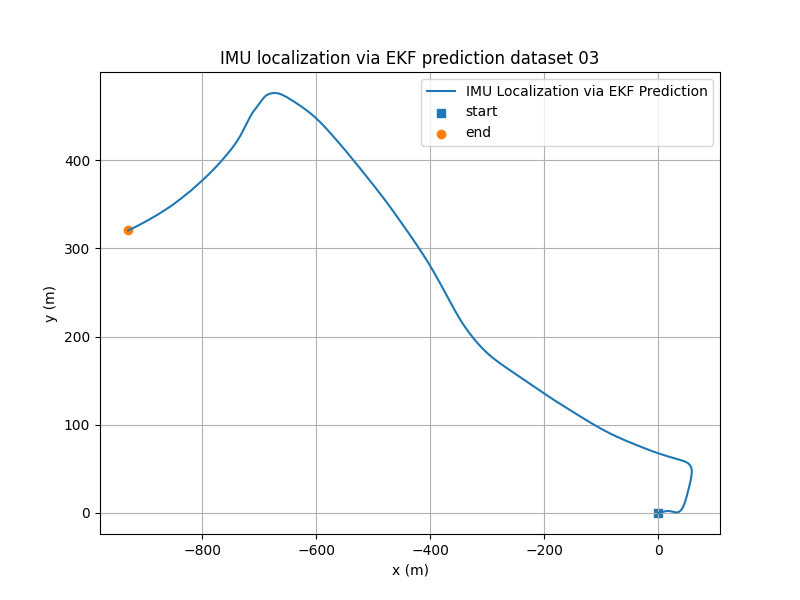
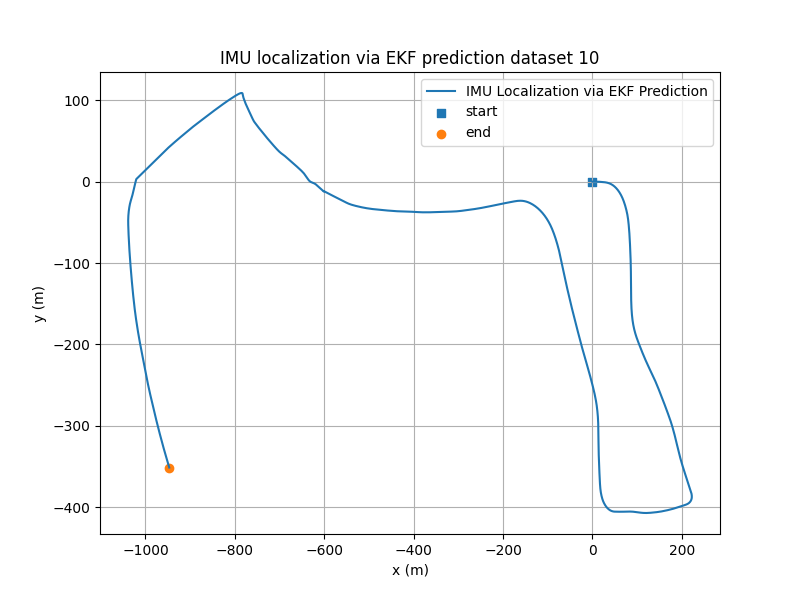
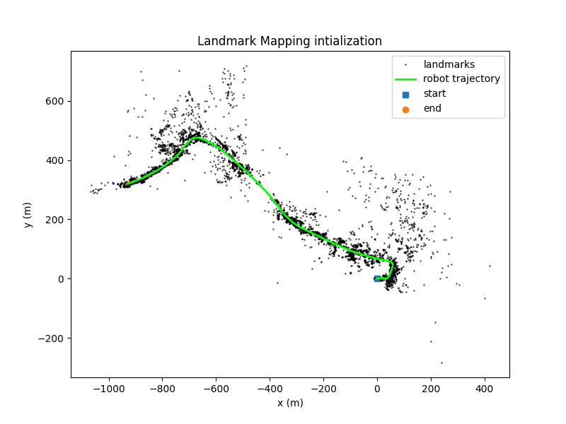
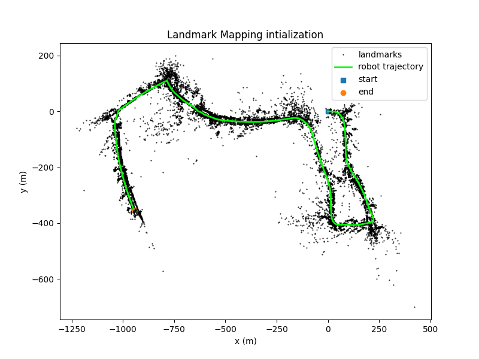
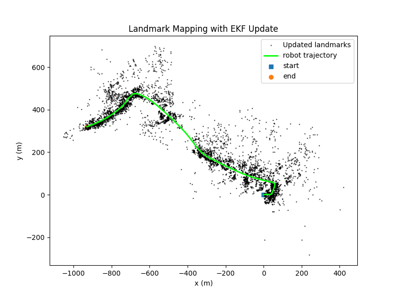
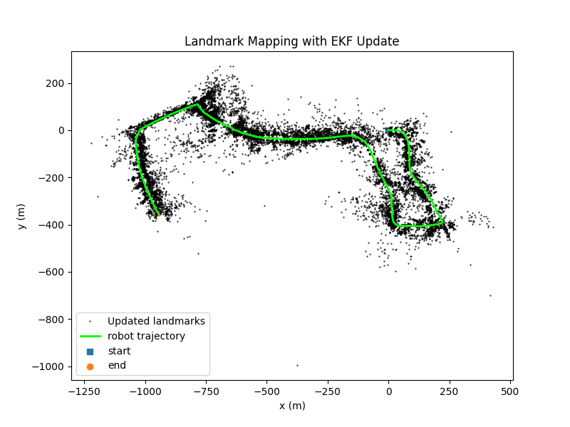
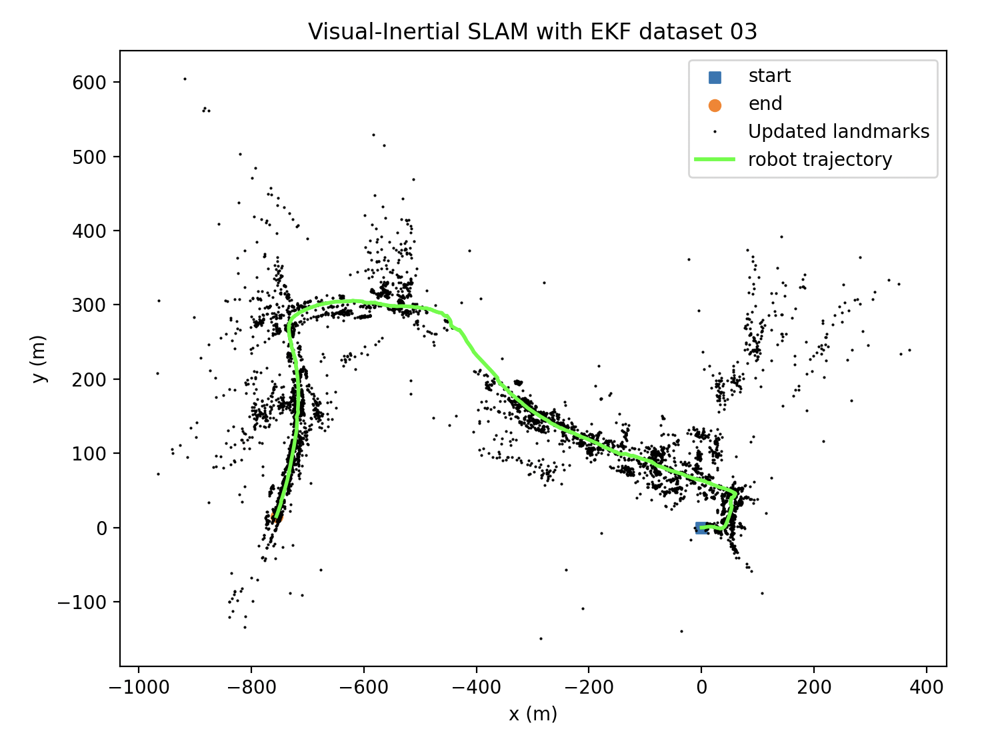
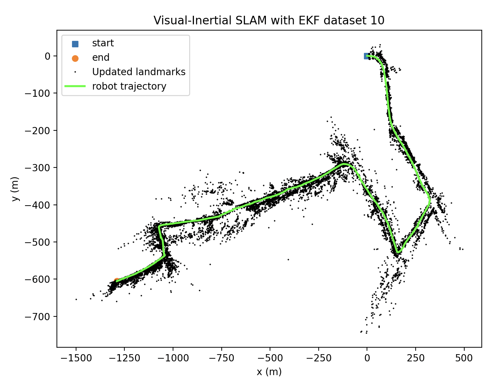

# Visual-Inertial SLAM
```
cd code
```
Visual landmarks mapping 
```
python main.py --Landmark_Mapping 
```
EKF Visual SLAM 
```
python main.py 
```

## Results
<div align="center">
  
  
</div>

---

<div align="center">
  
  
</div>

---

<div align="center">
  
  
</div>

---

<div align="center">
  
  
</div>


